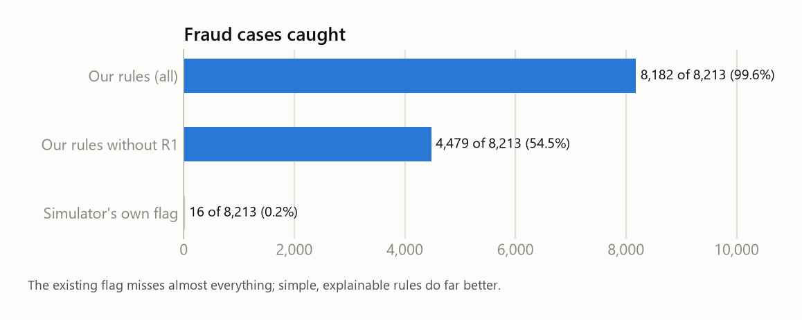
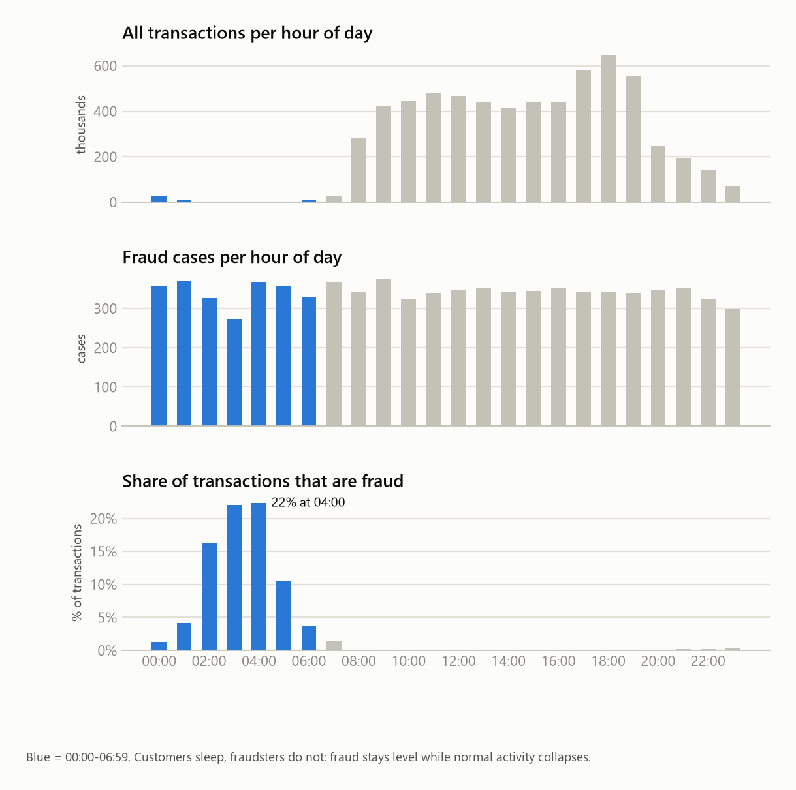
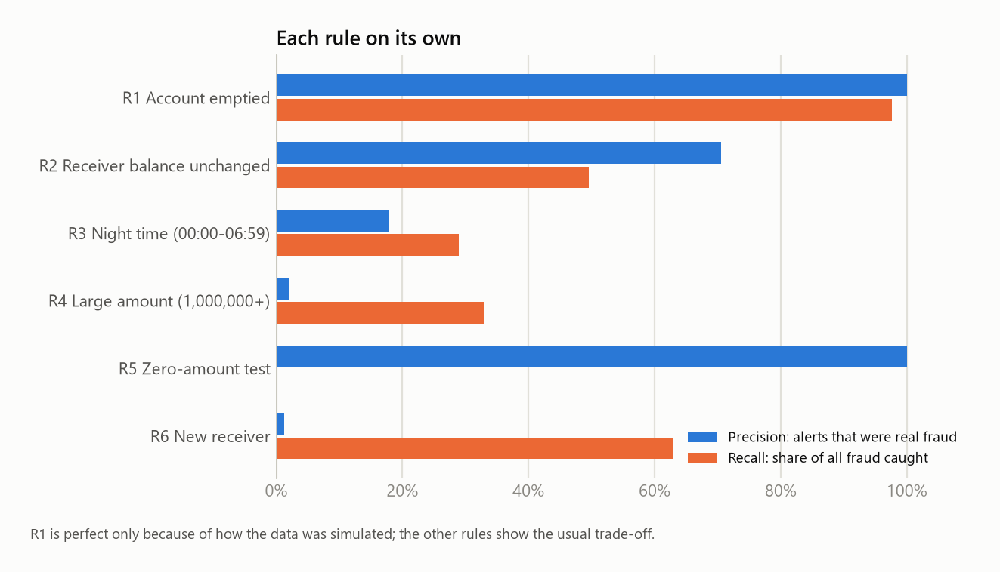

# Fraud detection analytics on mobile money transactions

Simple, explainable fraud rules on 6.3 million mobile money transactions: explore the data, score
every transaction, build an alert queue for analysts, write up the cases, and measure what the
rules catch and what they miss.

## Results

| | Alerts | Alerts per day | Real fraud among alerts (precision) | Fraud caught (recall) | Fraud money caught |
|---|---|---|---|---|---|
| Simulator's existing flag | 16 | 0.5 | 100% | 0.2% | - |
| **Our six rules** | 9,625 | 310 | 85.0% | 99.6% | 99.9% |
| Stress test: without rule R1 | 5,922 | 191 | 75.6% | 54.5% | 61.8% |

Why a stress test? Rule R1 ("the whole balance leaves in one transaction") is perfect in this
simulated data, which real data never is. The honest expectation for real data sits closer to the
stress-test line. See [docs/decisions.md](docs/decisions.md), entry 006.

## What the data showed

- All fraud is in **transfers and cash-outs**: money leaving the account (account takeover).
- **Fraud does not sleep.** Fraud stays level around the clock while normal activity collapses at
  night, so between 02:00 and 05:00 about one transaction in five is fraud.
  
- Fraudsters **empty the account**, often to a **new receiver** whose balance does not move.
- The stolen money is **cashed out within the hour**: 4,078 of 4,097 fraudulent transfers have a
  cash-out of exactly the same amount in the same hour.
- Some rules a fraud team would normally use are **not possible with this data** (almost no repeat
  customers, no devices or locations), which is documented rather than hidden.

## The rules

| Rule | Points | Signal |
|---|---|---|
| R1 | 40 | The whole sender balance leaves in one transaction |
| R2 | 25 | Receiving account shows no balance before or after |
| R3 | 15 | Between 00:00 and 06:59 |
| R4 | 15 | Amount of 1,000,000 or more |
| R5 | 40 | Zero-amount "test" transaction |
| R6 | 10 | First time the receiving account appears |

Risk score = sum of points. Alert at 30 or more; priority High 60+, Medium 40-59, Low 30-39.

Investigation write-ups of four alerts (a takeover, a false alarm, a missed fraud, a test
transaction): [docs/cases.md](docs/cases.md).

## How it works

| Stage | What happens | Where |
|---|---|---|
| 1. Load | CSV into DuckDB with explicit types; row count checked | scripts/01_load.py |
| 2. Profile | Missing values, duplicates, fraud by type, hour and amount, balance quality | scripts/02_profile.py, docs/results/01_profile.md |
| 3. Clean | Consistent names, day and hour, receiver type, balance-quality flags | sql/10_clean.sql |
| 4. Rules | Six rules, points, risk score, priority, reasons | sql/20_rules.sql |
| 5. Evaluate | Precision, recall, money caught, threshold choice, stress test | scripts/04_evaluate.py, docs/results/02_evaluation.md |
| 6. Power BI data | Alert, summary, rule and threshold tables plus DAX measures for reporting | powerbi/ |

## Run it

1. Install [uv](https://docs.astral.sh/uv/), then run `uv sync`.
2. Download PaySim from Kaggle (ealaxi/paysim1) and unzip the CSV into `data/raw/`.
3. `uv run python scripts/run_all.py` (a few minutes).

## Limitations

Synthetic data: no customer details, devices or locations, and some patterns are cleaner than
real life. Rules were set from the same month they are measured on (no separate test period).
Possible extensions: a "same amount cashed out in the same hour" rule, and a simple model to
compare with the rules.

## Data

E. A. Lopez-Rojas, A. Elmir and S. Axelsson, "PaySim: A financial mobile money simulator for
fraud detection", EMSS 2016. Dataset on Kaggle: ealaxi/paysim1.

## How this was built

Built with Claude Code, an AI coding assistant, which wrote the SQL, the Python and first drafts
of the write-ups. I set the goal and scope, drawing on my experience handling fraud cases in
banking, and reviewed the findings and numbers against the data.
